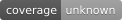

# AnotherMe TTS Server

[](https://github.com/Rx-K8/AnotherMe-TTS-Server/actions?query=workflow%3ATest)
[](https://github.com/Rx-K8/AnotherMe-TTS-Server/actions?query=workflow%3ALint)
[](https://github.com/Rx-K8/AnotherMe-TTS-Server/actions?query=workflow%3ATest)

## インストール

### uv環境のセットアップ

```bash
# uvのインストール（未インストールの場合）
curl -LsSf https://astral.sh/uv/install.sh | sh

# 本番環境
uv sync

# 開発環境
uv sync --group dev
```

### FlashAttention 2のインストール（推奨）

GPUメモリ使用量を削減するため、FlashAttention 2のインストールを推奨します。

```bash
uv pip install flash-attn --no-build-isolation
```

## サーバーの起動

```bash
uv run uvicorn app.main:app --host 0.0.0.0 --port 8001
```

初回起動時にHugging Faceから`Qwen/Qwen3-TTS-12Hz-1.7B-Base`モデルがダウンロードされます（約3.4GB）。

## Docker イメージのビルドと起動

### Docker イメージのビルド

```bash
docker build -t nvidia-anotherme/tts-server:12.8.1-cudnn-runtime-ubuntu22.04 .
```

### Docker コンテナの起動

```bash
docker run --rm -p 8001:8001 --gpus '"device=1"' nvidia-anotherme/tts-server:12.8.1-cudnn-runtime-ubuntu22.04
```
